# ***Fusion360 NEKONOTE***
This is an add-in for the Autodesk software Fusion360.

It shows/hides various folders in the browser tree at once.

In Japanese, the busy state is expressed as "I want to borrow the cat's hand". 
Is it really helpful to have a cat's hand(NEKONOTE)?

---

## **Installation**:

To install, download/extract the zip file and register the "NEKONOTE" folder as an **add-in**.

To register add-ins, follow the instructions [here](https://knowledge.autodesk.com/support/fusion-360/troubleshooting/caas/sfdcarticles/sfdcarticles/How-to-install-an-ADD-IN-and-Script-in-Fusion-360.html).

---

## **Usage**:

After launching the add-in, the "NEKONOTE" command will be added in "Utilities" - "Utilities".

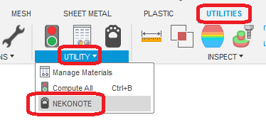

By clicking on it, a dialog will appear.

The dialog can be used for other tasks while it is displayed.

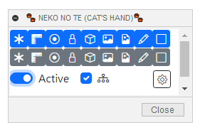

※The displayed text will switch between the languages supported by Fusion360.

#### show/hide buttons:
The top row are buttons to show and the bottom row are buttons to hide.

The targets are the following folders, the same as in GUI (manual operation).

(〇: operation target ✕: not target －: not shown)

|   | without link | with link | in-place editing |
| ------------- | ------------- | ------------- | ------------- |
| Origin | 〇 | 〇 | 〇 |
| Analysis | 〇 | － | 〇 |
| Origin of a joint | 〇 | ✕ | 〇 |
| Joint | 〇 | ✕ | 〇 |
| Body | 〇 | 〇 | 〇 |
| Canvas | 〇 | ✕| 〇 |
| Decal | 〇 | ✕| 〇 |
| Sketch | 〇 | 〇 | 〇 |
| Construction | 〇 | 〇 | 〇 |

The display/hide of each element within a folder is not changed because only the folder is displayed/hidden.

#### Processing Scope:

+ OFF: Show/hide for the entire active document.
+ ON: show/hide only for elements of the active component.
+ ON+include children: show/hide only for elements below the active component.

#### Preferences:

By unchecking each item, you can reduce the number of buttons to be displayed. However, it is not recommended to reduce the number of buttons because the layout will be broken if the number of buttons is greatly reduced.

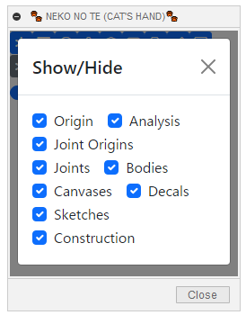

---

## **Notes/Limitations** :

+ Dialogs are set to not be resizable.
  + After docking the dialog to the top, bottom, left or right of the Fusion360, the size will become undesirable when undocked. If this happens, press the "" Preferences button to close it and it will return to its initial size.

  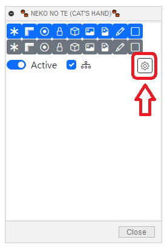

+ Not tested on MAC
+ Works only when "design" "render".
+ When something is selected, show/hide will deselect it.
+ Show/Hide does not change for hidden components.
+ Dialog cannot be invoked during in-place editing. (Please invoke it beforehand.)
+ "Active" during in-place editing may not be changed to show/hide correctly. We have confirmed the following conditions.
    + "Origin" is operated while "SubAssy" is active.
      + "Whole" does not process higher level components.

      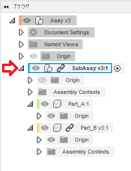

    + If "Origin" is operated while "Part_A" (internal component in SubAssy) is active.
      + "Whole" will process up to the component (SubAssy in the image) that entered the in-place editing, but not the higher level components.
      + "Active" will not process the active component, but the component (SubAssy in the image) that entered the in-place edit will be processed.
      + "active + includes children" will process the in-place editing component (SubAssy in the image) and the child components.

      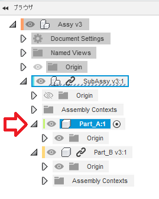

  + If a child component in a component during in-place editing is an external component, as shown above, "Joint origin", "Joint", "Canvas", "Decal" will not be processed.
    + As an example, with "SubAssy" active, the decals for "Part_B" are not processed.

      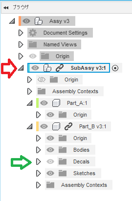

---

## **Action** :

The following environment is confirmed.

- Fusion360 Ver2.0.14113
- Windows10 64bit Pro , Home

---

## **License**:
- MIT

---

# *** 以下は日本語です。***

---

これは、オートデスクソフトウェア「Fusion360」のアドインです。

ブラウザツリーの各種フォルダーの表示/非表示をまとめて行います。

---

## **インストール**:

インストールする際は、zip ファイルをダウンロード/展開後 "NEKONOTE" フォルダを **アドイン** として登録してください。

アドインの登録は、[こちら](https://kantoku.hatenablog.com/entry/2021/02/15/161734)の手順に従ってください。

---

## **使用法**:

アドイン起動後は、"ユーティリティ" - "ユーティリティ" 内に "NEKONOTE" コマンドが追加されます。

クリックする事でダイアログが表示されます。

ダイアログは、表示したままの状態で他の作業を行う事が出来ます。

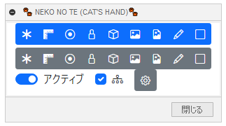

#### 表示/非表示ボタン:
上の段は表示、下の段は非表示のボタンになっています。

対象は以下のフォルダーで、GUI（手動操作）と同じです。

(〇：操作対象　✕:対象外　－：表示されていない)

|   | リンク無し | リンク有り | インプレイス編集 |
| ------------- | ------------- | ------------- | ------------- |
| 原点 | 〇 | 〇 | 〇 |
| 解析 | 〇 | － | 〇 |
| ジョイントの原点 | 〇 | ✕ | 〇 |
| ジョイント | 〇 | ✕ | 〇 |
| ボディ | 〇 | 〇 | 〇 |
| キャンバス | 〇 | ✕| 〇 |
| デカール | 〇 | ✕| 〇 |
| スケッチ | 〇 | 〇 | 〇 |
| コンストラクション | 〇 | 〇 | 〇 |

フォルダーの表示/非表示のみを行う為、フォルダ内の各要素の表示/非表示は変更しません。

#### 処理範囲:

+ OFF：アクティブなドキュメント全体に対して表示/非表示します。
+ ON: アクティブなコンポーネントの要素に対してのみ表示/非表示します。
+ ON+子も含む: アクティブなコンポーネント以下の要素に対してのみ表示/非表示します。

#### 環境設定:

各項目のチェックを外す事で、表示させるボタンを減らす事が可能です。但し大幅に減らした際レイアウトが崩れる為、あまりお勧めしません。

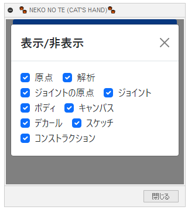

---

## **注意・制限** :

+ ダイアログのサイズ変更を出来ないように設定しています。
  + Fusion360の上下左右にダイアログをドッキングさせた後、ドッキングを解除した際にサイズが望ましくない状態となります。その際は "" 環境設定ボタンを押して閉じると最初のサイズに戻ります。

  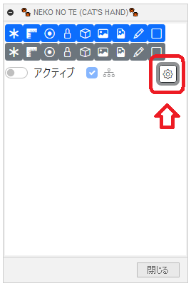
+ MACの動作未確認。
+ ”デザイン” "レンダリング" 時のみ機能します。
+ 何か選択している状態で、表示/非表示を行うと選択が解除されます。
+ 非表示コンポーネントについては、表示/非表示の変更は行いません。
+ インプレイス編集時にダイアログの呼び出しは出来ません。(事前に呼び出してください)
+ インプレイス編集時の "アクティブ" は正しく表示/非表示の変更されない可能性が有ります。以下の状態は確認しています。
    + "SubAssy" がアクティブな状態で "原点" を操作した場合。
      + "全体" で行っても上位のコンポーネントは処理しません。

      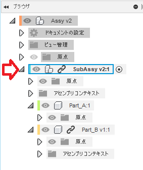

    + "Part_A"(SubAssy内の内部コンポーネント) がアクティブな状態で "原点" を操作した場合。
      + "全体" で行ってもインプレイス編集には入ったコンポーネント(画像ではSubAssy)までは処理しますが、上位のコンポーネントは処理しません。
      + "アクティブ" で行ってもアクティブなコンポーネントは処理されず、インプレイス編集には入ったコンポーネント(画像ではSubAssy)が処理しますが。
      + "アクティブ+子も含む" で行ってもインプレイス編集には入ったコンポーネント(画像ではSubAssy)と子コンポーネントが処理されます。

      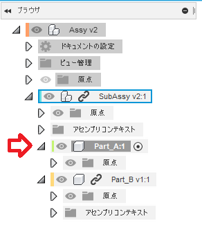

  + インプレイス編集時のコンポーネント内の子コンポーネントが外部コンポーネントの場合は上記に示した通り、"ジョイントの原点","ジョイント","キャンバス","デカール" 処理しません。
    + 例として、"SubAssy" がアクティブな状態で "Part_B" のデカールは処理しません。

      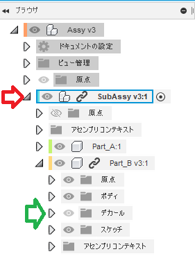

+ ~~何らかのコマンド実行直後は機能が停止している状態になっていますが、画面を少し動かしてください。~~
+ ~~非表示されているコンポーネント内の要素の表示が逆になる可能性があります。~~

---

## **TODO** :

+ ~~他コマンド実行中は機能を止める~~
+ ~~デザイン時以外は機能を止める~~
+ ~~リンク付きコンポーネントも対応~~
  + ~~無駄な項目の処理削除~~
  + ~~解析のみ別処理~~
+ コンポーネントの表示/非表示は入れるべきか？
+ ~~非表示コンポーネントは処理対象外にする。~~
+ ~~処理範囲のスコープを導入する。~~
+ ~~APIで切り替えられるものはAPIで処理する。~~　オーバーライドの問題を解決することが出来ない。
+ ~~表示ボタン設定をする為のオプションを用意する。~~
+ ~~UIのボタンをもう少し整理する。~~
+ ~~環境設定ボタンにツールチップを追加する。~~
+ ~~"子も含む" が不適切なタイミングで有効になる。(ドキュメントの切り替え時)~~
+ インストーラーを用意する。
+ 驚くほどの各アイコンのセンスの無さ

---

## **アクション** :

以下の環境で確認しています。

- Fusion360 Ver2.0.14113
- Windows10 64bit Pro , Home

---

## **ライセンス**:
- MIT

---

## **謝辞** :

- [日本語フォーラム](https://forums.autodesk.com/t5/fusion-360-ri-ben-yu/bd-p/707)の皆さん、ありがとう。
