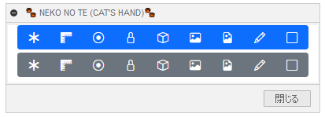

# ***Fusion360 NEKONOTE***
これは、オートデスクソフトウェア「Fusion360」のアドインです。

ブラウザツリーの各種フォルダーの表示/非表示をまとめて行います。

---

## **インストール**:

インストールする際は、zip ファイルをダウンロード/展開後 "NEKONOTE" フォルダを **アドイン** として登録してください。

アドインの登録は、[こちら](https://kantoku.hatenablog.com/entry/2021/02/15/161734)の手順に従ってください。

---

## **使用法**:

アドイン起動後は、"ユーティリティ" - "ユーティリティ" 内に "NEKONOTE" コマンドが追加されます。

クリックする事でダイアログが表示されます。

ダイアログは、表示したままの状態で他の作業を行う事が出来ます。

上の段は表示、下の段は非表示のボタンになっています。

対象は以下のフォルダーで、GUI（手動操作）と同じです。

(〇：操作対象　✕:対象外　－：表示されていない)

|   | リンク無し | リンク有り |
| ------------- | ------------- | ------------- |
| 原点 | 〇 | 〇 |
| 解析 | 〇 | － |
| ジョイントの原点 | 〇 | ✕ |
| ジョイント | 〇 | ✕ |
| ボディ | 〇 | 〇 |
| キャンバス | 〇 | ✕|
| デカール | 〇 | ✕|
| スケッチ | 〇 | 〇 |
| コンストラクション | 〇 | 〇 |

フォルダーの表示/非表示のみを行う為、フォルダ内の各要素の表示/非表示は変更しません。

---

## **注意・問題点** :

+ ”デザイン” 時のみ機能します。
+ 他のコマンド(例：押し出し)を実行中は機能を停止しています。(表示に問題あある為)
+ 何らかのコマンド実行直後は機能が停止している状態になっていますが、画面を少し動かしてください。
+ 非表示されているコンポーネント内の要素の表示が逆になる可能性があります。

---

## **TODO** :

+ ~~他コマンド実行中は機能を止める~~
+ ~~デザイン時以外は機能を止める~~
+ ~~リンク付きコンポーネントも対応~~
  + ~~無駄な項目の処理削除~~
  + ~~解析のみ別処理~~
+ コンポーネントの表示/非表示は入れるべきか？
  + 非表示コンポーネントの要素は除外する?
+ 驚くほどの各アイコンのセンスの無さ

---

## **アクション** :

以下の環境で確認しています。

- Fusion360 Ver2.0.13881
- Windows10 64bit Pro , Home

---

## **ライセンス**:
- MIT

---

## **謝辞** :

- [日本語フォーラム](https://forums.autodesk.com/t5/fusion-360-ri-ben-yu/bd-p/707)の皆さん、ありがとう。
