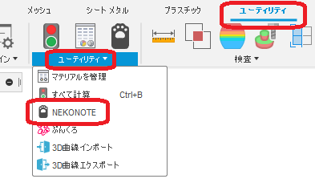
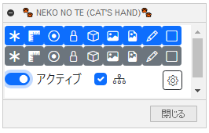

# ***Fusion360 NEKONOTE***
これは、オートデスクソフトウェア「Fusion360」のアドインです。

ブラウザツリーの各種フォルダーの表示/非表示をまとめて行います。

---

## **インストール**:

インストールする際は、zip ファイルをダウンロード/展開後 "NEKONOTE" フォルダを **アドイン** として登録してください。

アドインの登録は、[こちら](https://kantoku.hatenablog.com/entry/2021/02/15/161734)の手順に従ってください。

---

## **使用法**:

アドイン起動後は、"ユーティリティ" - "ユーティリティ" 内に "NEKONOTE" コマンドが追加されます。

クリックする事でダイアログが表示されます。

ダイアログは、表示したままの状態で他の作業を行う事が出来ます。

#### 表示/非表示ボタン:
上の段は表示、下の段は非表示のボタンになっています。

対象は以下のフォルダーで、GUI（手動操作）と同じです。

(〇：操作対象　✕:対象外　－：表示されていない)

|   | リンク無し | リンク有り | インプレイス編集 |
| ------------- | ------------- | ------------- | ------------- |
| 原点 | 〇 | 〇 | 〇 |
| 解析 | 〇 | － | 〇 |
| ジョイントの原点 | 〇 | ✕ | 〇 |
| ジョイント | 〇 | ✕ | 〇 |
| ボディ | 〇 | 〇 | 〇 |
| キャンバス | 〇 | ✕| 〇 |
| デカール | 〇 | ✕| 〇 |
| スケッチ | 〇 | 〇 | 〇 |
| コンストラクション | 〇 | 〇 | 〇 |

フォルダーの表示/非表示のみを行う為、フォルダ内の各要素の表示/非表示は変更しません。

#### 処理範囲:

+ OFF：アクティブなドキュメント全体に対して表示/非表示します。
+ ON: アクティブなコンポーネントの要素に対してのみ表示/非表示します。
+ ON+子も含む: アクティブなコンポーネント以下の要素に対してのみ表示/非表示します。

---

## **注意・制限** :

+ MACの動作未確認。
+ ”デザイン” "レンダリング" 時のみ機能します。
+ 何か選択している状態で、表示/非表示を行うと選択が解除されます。
+ 非表示コンポーネントについては、表示/非表示の変更は行いません。
+ インプレイス編集時にダイアログの呼び出しは出来ません。(事前に呼び出してください)
+ インプレイス編集時の "アクティブ" は正しく表示/非表示の変更されない可能性が有ります。以下の状態は確認しています。
    + "SubAssy" がアクティブな状態で "原点" を操作した場合。
      + "全体" で行っても上位のコンポーネントは処理しません。

      

    + "Part_A"(SubAssy内の内部コンポーネント) がアクティブな状態で "原点" を操作した場合。
      + "全体" で行ってもインプレイス編集には入ったコンポーネント(画像ではSubAssy)までは処理しますが、上位のコンポーネントは処理しません。
      + "アクティブ" で行ってもアクティブなコンポーネントは処理されず、インプレイス編集には入ったコンポーネント(画像ではSubAssy)が処理しますが。
      + "アクティブ+子も含む" で行ってもインプレイス編集には入ったコンポーネント(画像ではSubAssy)と子コンポーネントが処理されます。

      

  + インプレイス編集時のコンポーネント内の子コンポーネントが外部コンポーネントの場合は上記に示した通り、"ジョイントの原点","ジョイント","キャンバス","デカール" 処理しません。
    + 例として、"SubAssy" がアクティブな状態で "Part_B" のデカールは処理しません。
      

+ ~~何らかのコマンド実行直後は機能が停止している状態になっていますが、画面を少し動かしてください。~~
+ ~~非表示されているコンポーネント内の要素の表示が逆になる可能性があります。~~

---

## **TODO** :

+ ~~他コマンド実行中は機能を止める~~
+ ~~デザイン時以外は機能を止める~~
+ ~~リンク付きコンポーネントも対応~~
  + ~~無駄な項目の処理削除~~
  + ~~解析のみ別処理~~
+ コンポーネントの表示/非表示は入れるべきか？
+ ~~非表示コンポーネントは処理対象外にする。~~
+ ~~処理範囲のスコープを導入する。~~
+ ~~APIで切り替えられるものはAPIで処理する。~~　オーバーライドの問題を解決することが出来ない。
+ 表示ボタン設定をする為のオプションを用意する。
+ 驚くほどの各アイコンのセンスの無さ

---

## **アクション** :

以下の環境で確認しています。

- Fusion360 Ver2.0.14104
- Windows10 64bit Pro , Home

---

## **ライセンス**:
- MIT

---

## **謝辞** :

- [日本語フォーラム](https://forums.autodesk.com/t5/fusion-360-ri-ben-yu/bd-p/707)の皆さん、ありがとう。
